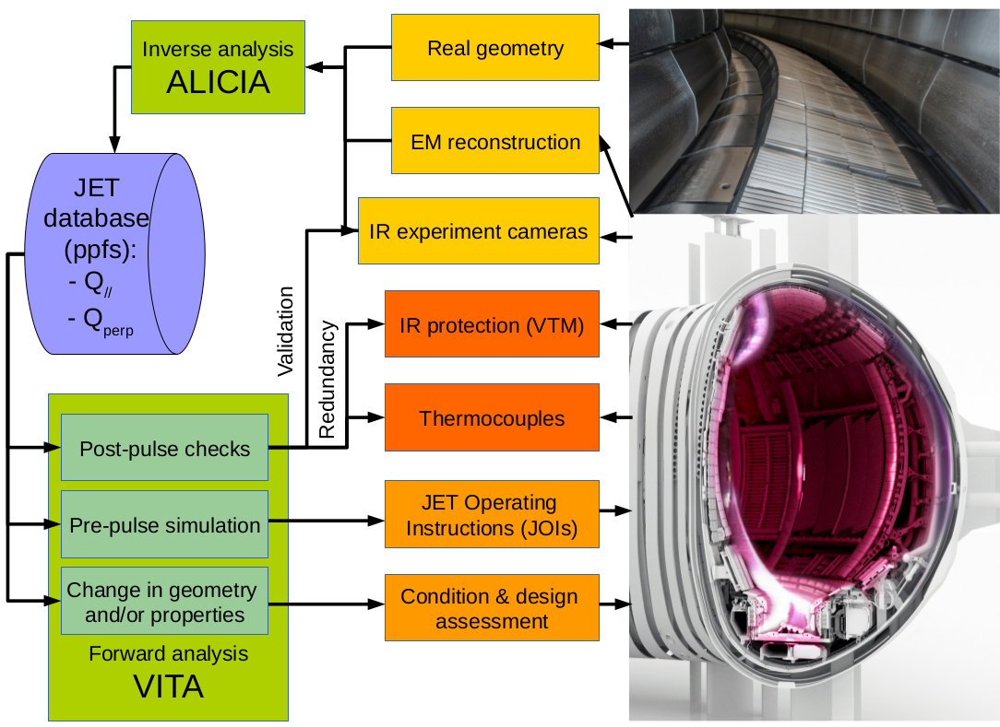
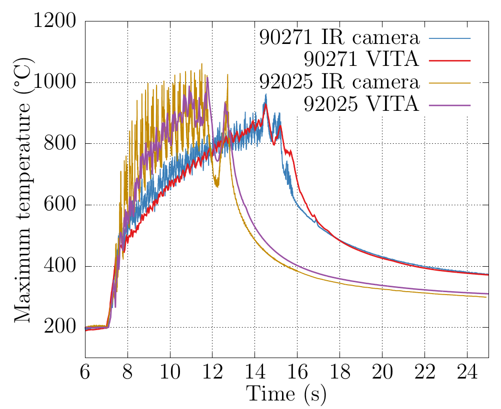

***********
Description
***********

==============================
Introduction and functionality
==============================

Vitaproject is part of a comprehensive tool-set for divertor modeling. The function and objectives of each tool, as
shown in Figure :numref:`fig-scheme-overview`_, vary depending on the operating phase. Vitaproject aims to deliver
the following functionality:

Design, assessment and preparation for operations:
  The objective of the modeling in this stage is to have a good estimate of the plasma loading effect, in order to
  assess compliance to the Design Criteria and to define the Operating Limits. The uncertainty at this stage is large
  so a large number of sensitivity analysis shall be required in order to establish the range of acceptable plasma
  parameters, as well as the risk of non-compliance.

Pulse monitoring:
  validated 2D nonlinear diffusion models are used for real-time temperature estimation. This synthetic diagnostic
  complements other protection measures such as thermography and thermocouple measurements.

Post-pulse processing:
  A Virtual Thermal Map (VTM) may be used based on processing protection IR camera data. A backup for recreating
  the surface and bulk temperatures shall be provided through quick analysis of hidden components, cross checking
  the VTM in case of dubious hotspots, and overall analysis in the case of IR camera malfunctioning.

Sensitivity, condition and change request assessment:
  any change on divertor components may be checked to actual experimental conditions, in order to evaluate the impact
  of any deviation from nominal geometry and properties as well as to assess major design modifications. This stage
  differs from the first one in that the model will have been already validated under nominal conditions and the
  workflow uses experimental data.

The workflow implemented bridges the Physics design, operational database and the engineering design and assessment.

.. _fig-scheme-overview:

   Overall workflow scheme

===========
Description
===========

*Virtual Thermal Assessments* is a forward simulation code featuring a GUI for ease of use. Its main goal is to allow
both quick and accurate analysis of divertor tiles to users by setting global machine parameters, recreating previous
stored pulses, or a mix of both. The time varying boundary conditions and integration parameters are automatically
set, therefore not requiring the user to deal with numerical details.

It is designed for design, pulse preparation activities, post-pulse checks, and integrity assessments of in-vessel
components. It may also be used to test alternative divertor configurations under experimental conditions. It includes
the following capabilities:

- Several ways for defining pulse parameters and automatically setting the simulation model and its boundary conditions.
- Connection to the experimental database for the readout of diagnostic measurements, typically temperatures.
- Selection of the wall segment or divertor tile with different accuracy on the thermal model.
- Direct plotting of diagnostic synthetic signals.
- Tabulated output of maximum temperature at the surface and thermocouple measurement locations, along with energy values.

The parameters that define the pulse can be grouped as follows:

Input power parameters:
  The total power input to the plasma arrives from either resistive heating, NBI or RF sources. Each of the three
  signals can be defined as a constant value or a table from a file allowing complex manual load inputs. In the
  case where an experimental pulse is to be recreated, each of these values can be read from their corresponding
  signal in the JET database.

Plasma parameters:
  The total power arriving to the divertor at any moment in time corresponds to the total minus the radiated power.
  This is taken into account as a factor in the range :math:`[0-1]` called the radiated fraction. The outboard-inboard
  power ratio is typically estimated in single null configurations as :math:`1/3` inboard, :math:`2/3` outboard, and
  :math:`1/10` inboard, :math:`9/10` outboard in double null configurations. The footprint can be defined using
  different functions:
  - A pure exponential function is the simplest way of defining the shape of the SOL power density around the plasma.
    When information about the far-SOL is known, a double exponential function may be used. Only the falloff length
    is needed for defining the footprint, allowing for a rough estimation of the power footprint at any PFC surface.
  - A square distribution may be used for fast transients simplified modeling of limited plasmas.
  - The convolution of an exponential with a Gaussian has been proven in [Eich2013]_ to be the best fit to the
    experimental observations for diverted plasma configurations. This function defines the profile of the scrape-off
    layer (SOL) at the equatorial plane. The parameters defining this function correspond to the power fall-off width,
    :math:`\\lambda`, and the spreading factor, :math:`S`. Their values can be manually fixed or estimated---as
    defined in [Riccardo2016]_---as a function of the plasma current, :math:`I_p`, toroidal field, :math:`B_t`,
    integrated density, :math:`n_e`, SOL power, :math:`P_{SOL}`, ELM frequency, :math:`f_{ELM}`, and the standard
    deviation of the radial field current, :math:`\sigma_{RF}`.

Magnetic parameters:
  In the latter case, the power density needs to be projected from the equatorial to the divertor plane. By default
  the flux expansion is used, but an option is available for performing a 3D magnetic projection using the magnetic
  field components and the equilibrium reconstruction provided by the Flush code [Pamella2015]_ at each
  calculation time step. A second option allows the magnetic shadowing of the surrounding tiles to be taken into
  account.

  The strike point position can be defined manually as a fixed location, or a regular sweep across it. It is also
  possible to input its evolution as a table or read it directly from an stored signal in the experimental database.

Analysis parameters:
  Once the physical quantities which define the loading conditions have been set, the Diritchlet boundary
  conditions are automatically defined in the model. The power density footprint is combined with the strike point
  time evolution, defining the power at each boundary point. The use of analytical functions for the heat flux
  profile allows calculating the exact power density at every surface node in an energy consistent manner (i.e.
  eliminating interpolation errors). In addition, the application of meshfree :math:`C^{\infty}` shape functions
  greatly increases the accuracy of surface temperature simulation. In the case where the loading parameters have
  been manually specified, the duration of the heating stage can be defined by the pulse time. Finally, the total
  simulation time is input using the analysis duration parameter.

The accuracy of VITA has been tested to experimental data with satisfactory results. Figure :numref:`fig-comparison`_
compares the response of two H-mode medium and high power pulses with the IR camera signal used for experiment data
analysis, which is much more accurate than the ones used for the protection of the JET-ILW [Jouve2011]_. Due to
the large number of signals used for recreating the loading conditions, there is of course an overall associated
uncertainty. The total error has been bounded to 10\% of the measured temperatures, being comparable to the mismatch
observed between the machine protection and experimental camera systems. The differences in amplitude during the
sweeping of the strike point position is mostly due to the IR being measured in a tile extension instead of the full
length tile. This short extension has a local shadow which amplifies the temperature oscillations. During the
upcoming campaign, a normal length tile will be diagnosed. This will allow the specific testing of VITA against
the alarms of the protection system. As the oscillation of the IR will be reduced, and the alarms are set to trigger
when 200ms overheating events are detected [Arnoux2012]_---in line with the response time of VITA models---,
lower errors are expected.

.. _fig-comparison:

   VITA synthetic reconstruction of maximum temperature IR signal compared to experiment IR camera measurement
   for two H-mode pulses with medium (90271), and high power (92025) input power.

==========
Input data
==========

Equilibrium
-----------

Static equilibrium
  reading them from equilibrium files in FIESTA or EQDSK formats.
Sweeping
  applies a displacement to the heat load along the divertor target.
Multiple equilibria
  uses several input files for defining a transient plasma load.

Plasma Parameters
-----------------

coming soon.
