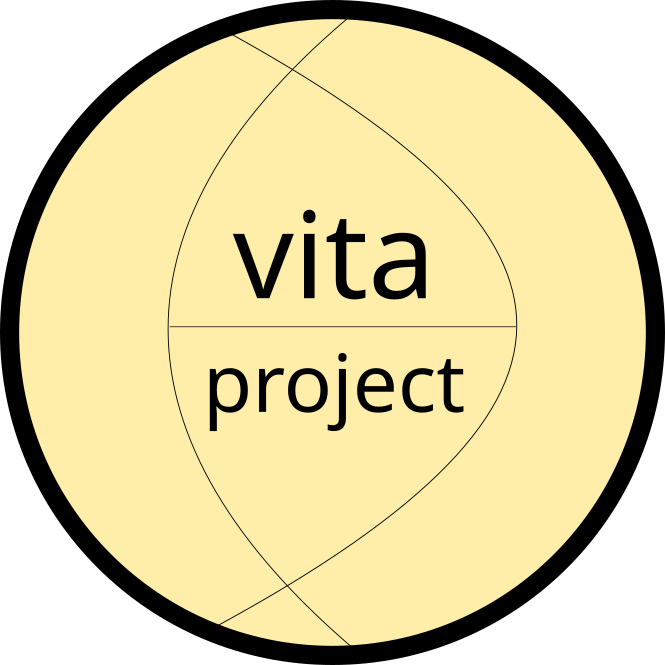

Welcome to VITA's documentation!
================================

.. toctree::
   :maxdepth: 2
   :caption: Contents:

.. title:: Home

|

|
|

Welcome
=======

Welcome to Vita! The Vitaproject is part of a comprehensive tool-set for divertor modeling.

Need Help?
----------

Please post a question on the `github issue queue <https://github.com/vitaproject/core/issues>`_.

.. toctree::
   :maxdepth: 2
   :numbered:
   :caption: Table of Contents
   :name: mastertoc

   introduction
   installation

.. toctree::
   :maxdepth: 3
   :numbered:
   :caption: Demonstrations
   :name: demonstrations

   demonstrations/demonstrations

.. toctree::
   :maxdepth: 3
   :numbered:
   :caption: API Reference
   :name: apireferenceto

   api_reference/equilibrium
   api_reference/projection
   api_reference/sol_heat_flux
   api_reference/utils

Indices and Tables
------------------

* :ref:`genindex`
* :ref:`modindex`
* :ref:`search`

